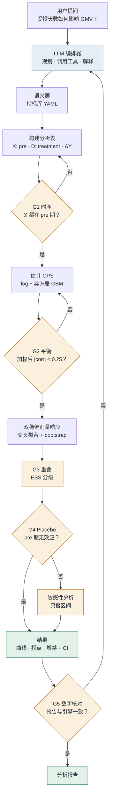

# 系统流程图（v0.3）

蓝色 = LLM 环节，橙色 = 假设把关 Gate，绿色 = 输出。

```mermaid
flowchart TD
    Q["用户提问<br/>妥投天数如何影响 GMV？"] --> O["LLM 编排器<br/>规划 · 调用工具 · 解释"]
    O --> S["语义层<br/>指标库 YAML"]
    S --> B["构建分析表<br/>X: pre · D: treatment · ΔY"]
    B --> G1{"G1 时序<br/>X 都在 pre 期？"}
    G1 -- 否 --> B
    G1 -- 是 --> GPS["估计 GPS<br/>log + 异方差 GBM"]
    GPS --> G2{"G2 平衡<br/>加权后 |corr| < 0.25？"}
    G2 -- 否 --> GPS
    G2 -- 是 --> DR["双稳健剂量响应<br/>交叉拟合 + bootstrap"]
    DR --> G3["G3 重叠<br/>ESS 分级"]
    G3 --> G4{"G4 Placebo<br/>pre 期无效应？"}
    G4 -- 是 --> OUT["结果<br/>曲线 · 拐点 · 增益 + CI"]
    G4 -- 否 --> SEN["敏感性分析<br/>只报区间"]
    SEN --> OUT
    OUT --> G5{"G5 数字核对<br/>报告与引擎一致？"}
    G5 -- 否 --> O
    G5 -- 是 --> R["分析报告"]
    classDef gate fill:#fbf0de,stroke:#a5620a,color:#1b2230;
    classDef llm fill:#e3eef6,stroke:#1f5f8b,color:#1b2230;
    classDef out fill:#e2f2e8,stroke:#2d7a4f,color:#1b2230;
    class G1,G2,G3,G4,G5,SEN gate;
    class O llm;
    class OUT,R out;
```
